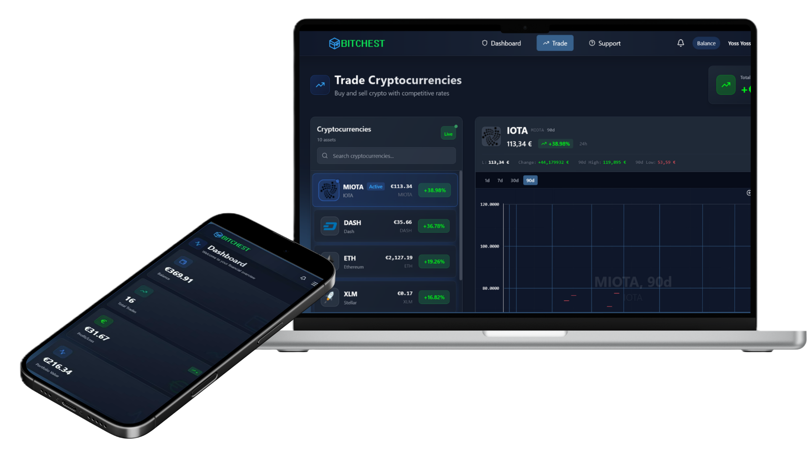

<div align="center">


# BitChest — Plateforme de simulation d'achat et de vente de cryptomonnaies

**Projet de fin de formation — Développeur Web & Web Mobile**

Application web complète permettant à des utilisateurs d'acheter, de conserver et de revendre
des cryptomonnaies à l'aide d'un portefeuille virtuel en euros, et à des administrateurs de
piloter la plateforme.



</div>

---

## Table des matières

1. [Présentation](#1-présentation)
2. [Objectifs pédagogiques](#2-objectifs-pédagogiques)
3. [Fonctionnalités](#3-fonctionnalités)
4. [Pile technologique](#4-pile-technologique)
5. [Installation et démarrage](#5-installation-et-démarrage)
6. [Comptes de démonstration](#6-comptes-de-démonstration)
7. [Principales routes de l'API](#7-principales-routes-de-lapi)
8. [Assistant de support](#8-assistant-de-support)
9. [Sécurité](#9-sécurité)
10. [Tests et qualité de code](#10-tests-et-qualité-de-code)
11. [Choix techniques](#11-choix-techniques)
12. [Limites connues et perspectives](#12-limites-connues-et-perspectives)
13. [Auteur](#13-auteur)

---

## 1. Présentation

BitChest est une plateforme fictive de courtage en cryptomonnaies développée dans le cadre du
projet de fin de formation. Elle gère **dix cryptomonnaies** (Bitcoin, Ethereum, Ripple,
Bitcoin Cash, Cardano, Litecoin, NEM, Stellar, IOTA, Dash), un **portefeuille virtuel en
euros** crédité à l'inscription, l'**historique des cotations** et deux profils
d'utilisateurs : le **client**, qui investit, et l'**administrateur**, qui gère la plateforme.

Le projet est composé de trois parties :

- **`bitchest-backend/`** — l'API REST (Laravel 10) qui centralise toute la logique métier et
  l'accès à la base de données.
- **`bitchest-frontend/`** — l'interface web monopage (Vue 3 + TypeScript) utilisée par les
  clients et les administrateurs.
- **`bot/`** — un service d'assistance au support, bilingue français / anglais, qui répond
  aux questions des utilisateurs connectés.

---

## 2. Objectifs pédagogiques

| Domaine | Mise en œuvre dans BitChest |
|---|---|
| Base de données relationnelle | Schéma normalisé, migrations versionnées, montants stockés en `DECIMAL` |
| API REST sécurisée | Laravel 10 + Sanctum, séparation des rôles client / administrateur |
| Interface monopage (SPA) | Vue 3 + TypeScript, gestion d'état avec Pinia, routage et gardes de navigation |
| Consommation d'une API tierce | Récupération des cours via l'API publique Coinbase, avec cache et repli sur la base |
| Organisation du code | Logique métier isolée dans des classes de service, contrôleurs légers |
| Qualité logicielle | Tests unitaires PHPUnit, typage strict TypeScript, ESLint, Laravel Pint |

---

## 3. Fonctionnalités

### 3.1 Visiteur (non connecté)

- Page d'accueil de présentation avec les cours du marché.
- Inscription et connexion.

### 3.2 Client

- **Tableau de bord** : solde en euros, valeur totale du portefeuille, plus ou moins-value,
  nombre de transactions, répartition des avoirs.
- **Marché** : les dix cryptomonnaies, cours actuel, variation sur 24 h, graphique
  d'historique (1 j / 7 j / 30 j / 90 j).
- **Achat et vente** : acquisition d'une quantité de crypto contre des euros, revente au cours
  courant, avec contrôle du solde et de la quantité détenue.
- **Portefeuille** : détail par crypto, prix de revient moyen, quantité, valorisation.
- **Historique** : liste de toutes les transactions du client.
- **Profil** : informations personnelles, photo de profil et bannière, changement de mot de
  passe avec contrôle de robustesse.
- **Support** : page d'assistance et widget de discussion.
- **Notifications** : alertes de portefeuille, montée de niveau, validation de compte.

### 3.3 Administrateur

- **Tableau de bord** : nombre de clients, comptes actifs ou en attente de validation, somme
  des soldes, chiffre d'affaires, volume de transactions, activités récentes.
- **Gestion des clients** : création, consultation, modification, suppression, validation ou
  blocage d'un compte. Les comptes créés par l'administrateur reçoivent un mot de passe
  provisoire à changer à la première connexion.
- **Gestion du marché** : consultation de l'historique des cours, génération de cotations,
  prévisualisation d'une mise à jour des prix puis approbation avant enregistrement.
- **Transactions** : consultation de l'historique global de la plateforme.

### 3.4 Cycle de vie d'un compte

Un compte passe par les états *en attente*, *en attente de validation*, *actif* puis
éventuellement *bloqué*. Seul un compte **actif** peut accéder aux fonctionnalités protégées.

---

## 4. Pile technologique

### Backend — `bitchest-backend/`

| Composant | Version | Rôle |
|---|---|---|
| PHP | 8.1+ | Langage |
| Laravel | 10.x | Framework de l'API |
| Laravel Sanctum | 3.x | Authentification par jeton |
| MySQL / MariaDB | 5.7+ / 10.x | Base de données |
| Guzzle | 7.x | Client HTTP pour l'API Coinbase |
| PHPUnit | 10.x | Tests |

### Frontend — `bitchest-frontend/`

| Composant | Version | Rôle |
|---|---|---|
| Vue | 3.5 | Framework de l'interface |
| TypeScript | 5.9 | Typage statique |
| Vite | 5.4 | Outil de build et serveur de développement |
| Pinia | 2.2 | Gestion d'état |
| Vue Router | 4.6 | Routage et gardes de navigation |
| Axios | 1.7 | Client HTTP |
| ApexCharts | 5.3 | Graphiques des cours |
| Tailwind CSS | 3.4 | Styles |

### Service de support — `bot/`

| Composant | Version | Rôle |
|---|---|---|
| Python | 3.12 | Langage |
| FastAPI | 0.111 | Serveur du service |
| Groq API | `openai/gpt-oss-120b` | Modèle de langage |

---

## 5. Installation et démarrage

### 5.1 Prérequis

- PHP **8.1+** et Composer
- Node.js **18+** et npm
- MySQL / MariaDB (via XAMPP par exemple)
- Python **3.12** (pour le service de support, optionnel)

### 5.2 Backend — API Laravel

```bash
cd bitchest-backend
composer install
cp .env.example .env
php artisan key:generate
```

Renseigner la connexion à la base dans `.env` :

```env
DB_DATABASE=bd_bitchest
DB_USERNAME=root
DB_PASSWORD=
```

Créer la base, puis :

```bash
php artisan migrate --seed
php artisan storage:link
php artisan serve            # http://localhost:8000
```

### 5.3 Frontend — interface Vue

```bash
cd bitchest-frontend
npm install
```

Fichier `.env.local` :

```env
VITE_API_BASE_URL=http://localhost:8000
VITE_BOT_API_URL=http://localhost:8000/api/support
```

```bash
npm run dev                 # http://localhost:5173
npm run build               # build de production
```

### 5.4 Service de support (optionnel)

```bash
cd bot
py -3.12 -m venv venv
.\venv\Scripts\pip install -r requirements.txt
cp .env.example .env        # renseigner GROQ_API_KEY
.\serve.ps1                 # http://127.0.0.1:8001
```

Sans ce service, l'application reste pleinement fonctionnelle ; seule la page de support
renvoie une erreur contrôlée.

---

## 6. Comptes de démonstration

Créés par les seeders lors de `php artisan migrate --seed` :

| Rôle | Email | Mot de passe | Remarques |
|---|---|---|---|
| Administrateur | `admin@bitchest.com` | `admin123` | Accès complet au back-office |
| Client | voir `database/seeders/UserSeeder.php` | — | Chaque client est crédité de **500 €** virtuels |

Ces identifiants sont destinés à un environnement local uniquement.

---

## 7. Principales routes de l'API

Base : `http://localhost:8000/api` — Authentification : en-tête `Authorization: Bearer <token>`.
Une collection Postman est fournie :
[`bitchest-backend/BitChest_API.postman_collection.json`](bitchest-backend/BitChest_API.postman_collection.json).

### Routes publiques

| Méthode | Route | Description |
|---|---|---|
| `POST` | `/register` | Inscription d'un client |
| `POST` | `/login` | Connexion, renvoie le jeton |
| `GET` | `/public/market` | Cours du marché pour la page d'accueil |

### Routes client

| Méthode | Route | Description |
|---|---|---|
| `GET` | `/portfolio` | Portefeuille consolidé |
| `POST` | `/transaction/buy` | Achat de crypto |
| `POST` | `/transaction/sell` | Vente de crypto |
| `GET` | `/transaction/history` | Historique des transactions |
| `GET` | `/market` | Marché (dix cryptos) |
| `GET` | `/market/history/{id}` | Historique des cours d'une crypto |
| `PUT` | `/profile` | Mise à jour du profil |

### Routes administrateur (préfixe `/admin`)

| Méthode | Route | Description |
|---|---|---|
| `GET` | `/admin/dashboard` | Statistiques de la plateforme |
| `GET` `POST` `PUT` `DELETE` | `/admin/users` | Gestion des clients |
| `POST` | `/admin/users/{id}/approve` · `/block` | Validation ou blocage d'un compte |
| `GET` | `/admin/cryptos/preview` | Prévisualisation d'une mise à jour des prix |
| `POST` | `/admin/cryptos/preview/approve` | Enregistrement des nouveaux prix |
| `GET` | `/admin/transactions` | Historique global des transactions |

---

## 8. Assistant de support

Le dossier `bot/` fournit un service d'assistance, appelé uniquement par le backend Laravel
(jamais directement par le navigateur) :

- **Bilingue** français / anglais : répond dans la langue du message.
- **Périmètre limité** à BitChest, aux cryptomonnaies et au compte de l'utilisateur connecté.
- **Aucune invention de données** : il indique l'absence d'information plutôt que d'inventer un
  solde ou un prix.
- **Confidentialité** : ne révèle jamais un mot de passe, un jeton ou une clé.
- **Accès en lecture seule** aux données de l'utilisateur, dont l'identifiant est imposé par
  le backend.

Le dossier possède son propre README détaillé : [`bot/README.md`](bot/README.md).

---

## 9. Sécurité

- Authentification par jetons Laravel Sanctum, révoqués à la déconnexion.
- Mots de passe hachés (bcrypt) ; contrôle de robustesse au changement ; mot de passe
  provisoire imposé aux comptes créés par l'administrateur.
- Contrôle des rôles côté serveur (middleware `role:client` / `role:admin`).
- Seuls les comptes au statut *actif* accèdent aux fonctionnalités protégées.
- Le service de support n'est jamais exposé au navigateur ; le backend impose l'identité de
  l'utilisateur, ce qui empêche l'accès aux données d'autrui.
- Montants monétaires stockés en `DECIMAL` et contrôles de solde et de quantité avant chaque
  transaction.
- Limitation de débit sur les routes sensibles.
- Les fichiers `.env` sont exclus du versionnement ; seuls les `.env.example` sont suivis.

---

## 10. Tests et qualité de code

```bash
cd bitchest-backend
php artisan test
```

Les tests couvrent la logique métier critique : calcul de la quantité détenue et de la
valorisation du portefeuille, règles d'achat et de vente, contrôle du solde, relations du
modèle de données et règles de validation des requêtes.

```bash
./vendor/bin/pint                              # formatage du backend
cd ../bitchest-frontend && npx eslint src && npm run build   # lint et vérification des types
```

---

## 11. Choix techniques

| Décision | Justification |
|---|---|
| API REST séparée de l'interface | Séparation des responsabilités, interface plus fluide, API réutilisable |
| Sanctum en mode jeton | Interface et API sur des origines distinctes, authentification simple à raisonner |
| Logique métier dans des classes de service | Contrôleurs légers, code testable et réutilisable |
| Montants en `DECIMAL` | Suppression des erreurs d'arrondi dans un contexte financier |
| Prévisualisation puis approbation des prix | Contrôle humain avant toute modification du marché |
| Cache et repli sur la base pour les cours | Résilience face à l'indisponibilité de l'API Coinbase |
| Service de support séparé | Isolation de la clé d'API, langage adapté sans alourdir le backend |

---

## 12. Limites connues et perspectives

- Les cours dépendent d'une API publique ; il n'y a pas de flux en temps réel.
- La couverture de tests est concentrée sur la logique métier critique.
- L'envoi réel d'e-mails nécessite une configuration SMTP valide.
- Pistes d'amélioration : export CSV de l'historique, intégration continue exécutant les
  tests et le lint, conteneurisation complète, internationalisation de l'interface.

---

## 13. Auteur

Projet réalisé par **Shedly Laadhiby** dans le cadre de la formation
**Développeur Web & Web Mobile**.

- Backend : Laravel 10, API REST, Sanctum, MySQL
- Frontend : Vue 3, TypeScript, Vite, Tailwind CSS
- Service de support : FastAPI, Groq

<div align="center">


</div>
